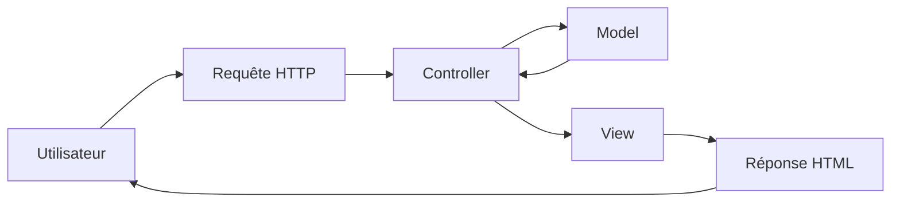

# Symfony

### Vue d'ensemble

Symfony est un Framework PHP open-source permettant de concevoir des appli web robuste qui se repose sur une architecture MVC (Modèle-Vue-Contrôleur). Il est devenu très populaire grâce à son maintient et évolution permanente. La communauté Symfony étant très active ce n'est pas l'aide qui manque.

SensioLabs est l’entreprise française qui a conçu le framework dont la première version a vu le jour en 2005. Depuis Symfony n'a pas cessé d'évoluer. Aujourd'hui (mars 2026) la version **8.0** est disponible. Chaque version à son support long terme (TLS) qui voit le jour tous les 2 ans environ. La version majeur en TLS actuellement est la **7.4** qui sera complétement maintenu jusqu'en 2028/2029

Vous pouvez visualiser les versions ainsi que leurs date de maintient ici :
https://symfony.com/releases

Différents outils composent Symfony, qu'on verra par la suite, tel que :

- **Composer** pour gérer les dépendances
- **Symfony Flex** qui simplifie l’installation des bundles
- **Doctrine ORM** pour la gestion de base de données
- **Twig** qui est le moteur de template pour générer des vues HTML dynamique
- **PhpUnit** pour les tests
- Et bien d’autre… Sans surprise

---

```php
namespace App\Controller;

use Symfony\Bundle\FrameworkBundle\Controller\AbstractController;
use Symfony\Component\HttpFoundation\Response;
use Symfony\Component\Routing\Attribute\Route;

final class HelloController extends AbstractController
{
    #[Route('/hello', name: 'app_hello')]
    public function index(): Response
    {
        return $this->render('hello/hello.html.twig');
    }

}

```

---
### Architecture MVC
Symfony est basé sur le pattern MVC (Model View Controller). C'est un modèle qui permet de séparer les responsabilités dans une application Web
En séparant la gestion des données, la logique applicative et l'affichage, ça les applications plus claires, maintenables et évolutives.


**Le Modèle (Model)**

Le modèle représente les données et la logique de l'app. Dans Symfony, ça correspond :
- Aux entités Doctrine
- Aux repositories

```php
#[ORM\Entity]
class Produit
{
    #[ORM\Column]
    private string $nom;
}
```

Le modèle est responsable de gérer les données et d'interagir avec la base de données

**La Vue (View)**

La vue est responsable de l'affichage des données. Dans Symfony ça correspond aux **templates Twig**

```twig
<h1>{{ article.title }}</h1>
<p>{{ article.content }}</p>
```

La vue :
- Affiche les données
- Ne contient pas de logique métier
- Sert uniquement à présenter l'information

**Le Contrôleur (Controller)**

Le contrôleur est l'intermédiaire entre **le modèle** et **la vue**. Ce sont des classes dans ``/src/Controller``

```php
#[Route('/produit/{id}', name: 'produit_show')]
public function show(Produit $produit): Response
{
    return $this->render('produit/show.html.twig', [
        'produit' => $produit
    ]);
}
```

Le contrôleur :

- reçoit la requête HTTP
- récupère les données nécessaires
- appelle les services
- renvoie une réponse




