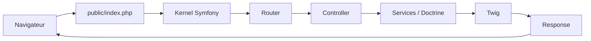

# Création d'un projet

### Contexte

Pour ce cours, on va privilégier Symfony 7.4 car elle possède la version LTS (Long Term Support), ce qui n'est pas le cas de Symfony 8.0. Même si la version 8.0 est plus moderne, elle ne sera plus maintenu au cours de l'année 2026. Dans le cadre d'un véritable projet, toujours se mettre sur la version LTS.

---

## Prérequis

Installer le nécessaire comme cité dans le fichier précédent [1-2-Installation.md](1-2-Installation.md)

## Création du projet

1. `symfony new nom_projet --webapp --version=7.4`
    - `--webapp` - Installe la version complète
    - `--version` - Permet de préciser la version qu'on souhaite installer

2. `cd nom_projet`
3. `composer install` - Installe les dépendances (bundles) du projet présent dans `composer.json`
4. `symfony server:start`
    - Permet de lancer un serveur local
    - L'option `-d` permet de lancer le serveur en arrière plan
5. Dans un navigateur : http://localhost:8000

## Arborescence d'un projet

### `/assets`
Contient les ressources front-end (CSS, JS, Images...).
Ces fichiers seront compilés ou copiés vers le dossier **/public**

### `/bin`
Contient les scripts exécutables du projet : `php bin/console`

### `/config`
Contient toute la configurion Symfony :
- **/packages** : configuration de chaque bundle
- **routes.yaml** : Déclaration des routes (peut être fait dans les contrôleurs directement)

### `/migrations`
Regroupe les fichiers de migrations. Un fichier de migration contient les requêtes SQL pour mettre notre base de données à jour. Ils sont souvent créés automatiquement

### `/public`
C'est la racine publique du site, c'est le point d'entrée de l'application grâce au fichier ``index.php`` (front controller). Toutes les requêtes passent par ce fichier

### `/src`
Contient tout le code métier. Chaque répertoire à l’intérieur a son importance. Il vous est possible d’en créer d'autres selon vos besoins.

- **/Controller** : Contient toutes les classes contrôleurs qui traiteront les requêtes
- **/Entity** Contient les classes d'entités
- **/Repository**
- **/Service** : Il faut le créer. Il contiendra les classes métier et services (La gestion des mails par exemple)

### `/templates`
Contient les fichiers de templates Twig pour générer l’HTML. On retrouve le fichier de base ``base.html.twig`` qui sera étendu à tous les autres

### `/tests`
Regroupe tous les tests que vous mettrez en place

### `/translations`
Contient les fichiers de traduction

### `/var`
Contient les fichiers temporaires générés par Symfony, tel que le cache et les logs
> **⚠️ Ce dossier ne doit pas être versionné**

### `/vendor`
Contient toutes les dépendances du projet installé via Composer

> **⚠️ Ce dossier ne doit pas être versionné et ne doit jamais être modifié directement**

### `.env`
Fichier d’environnement pour paramétrage des variables, connexion à la base de données… En général on créera un .env.local

### `composer.json`
Décrit les dépendances PHP installés
