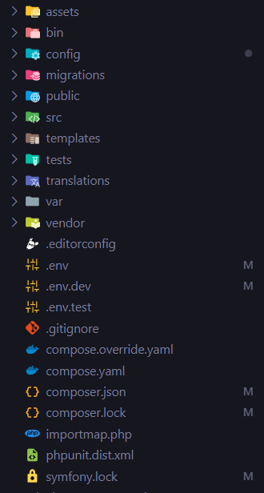

# Création d'un projet

### Contexte

Pour ce cours, on va privilégier Symfony 7.4 car elle possède la version LTS (Long Term Support), ce qui n'est pas le cas de Symfony 8.0. Même si la version 8.0 est plus moderne, elle ne sera plus maintenu au cours de l'année 2026. Dans le cadre d'un véritable projet, toujours se mettre sur la version LTS.

---

## Prérequis

Installer le nécessaire comme cité dans le fichier précédent [1-2-Installation.md](1-2-Installation.md)

## Création du projet

1. `symfony new nom_projet --webapp --version=7.4`
    - `--webapp` - Installe la version complète
    - `--version` - Permet de préciser la version qu'on souhaite installer

2. `cd nom_projet`
3. `composer install` - Installe les dépendances (bundles) du projet présent dans `composer.json`
4. `symfony server:start`
    - Permet de lancer un serveur local
    - L'option `-d` permet de lancer le serveur en arrière plan
5. Dans un navigateur : http://localhost:8000

## Arborescence d'un projet

|  |  |
|-----|-|
|  |   - **assets/** Regroupe tous vos fichiers CSS / JS / images    - **bin/** : Contient des fichiers exécutables qui vont permettre l'éexecution de commande   - **config/** : Regroupe les fichiers de configration   - **migrations/** : Regroupe les fichiers de migrations. Un fichier de migration contient les requêtes SQL pour mettre notre base de données à jour. Ils sont souvent créés automatiquement   - **public/** : contient les fichiers accessibles publiquement, c’est le point d'entrée de l’application. On peut y mettre des images / css / js. Le fichier principal est index.php, qui est exécuté à chaque requête sur le serveur    - **src/**  : Contient tout le code source. Chaque répertoire à l’intérieur a son importance. Il vous est possible d’en créer d'autres selon vos besoins.    - **templates/** : Contient les fichiers de templates Twig pour générer l’HTML. On retrouve le fichier de base base.html.twig qui sera étendu à tous les autres    - **tests/** : Regroupe tous les tests que vous mettrez en place    - **translations/** : Contient les fichiers de traduction    - **var/** : Contient les fichiers temporaires générés par Symfony, tel que le cache et les logs    - **vendor/** : Contient toutes les dépendances du projet installé via Composer ou par défaut par Symfony    - **.env** : Fichier d’environnement pour paramétrage des variables, connexion à la base de données… En général on créera un .env.local    - **composer.json**   - **composer.lock**   - **symfony.lock** |