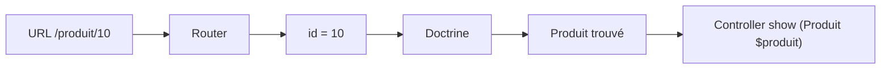

# Paramètres des routes


Comme nous l’avons vu précédemment, une route n’est pas seulement une URL fixe. Elle peut contenir des paramètres qui permettent de rendre l'URL dynamiques et de transmettre des données. Mais pas que ! Contraintes avec regex, valeurs par défaut, multi paramètres, route dédié a un environnement, priorité des routes...

---


## 1. Paramètres dans une route (rappel)

```php
    #[Route('/produit/{id}', name: 'produit_show', methods: ['GET'])]
    public function show(int $id): Response
    {
        return $this->render('produit/show.html.twig', [
            'id' => $id,
        ]);
    }
```

Ici, **`{id}`** est passé en paramètre dans la route, et peut donc être récupéré directement dans la variable du même nom **`$id`** avec le typage défini. 

## 2. Multi Paramètres dans une route

On peut appliquer plusieurs paramètres dans une route en répétant le même principe
```php

    #[Route('/categorie/{categorie}/produit/{id}', name: 'produit_show', methods: ['GET'])]
    public function show(string $categorie, int $id): Response
    {
        return $this->render('produit/show.html.twig', [
            'categorie' => $categorie,
            'id' => $id,
        ]);
    }
```

## 3. Contraintes (requirements)

```php
    #[Route('/produit/{id}', name: 'produit_show', requirements:['id' => '\d+'],methods: ['GET'])]
    public function show(int $id): Response
        ...
```

Ici grâce à `requirements` on applique **une contrainte de validation** au paramètre `id`, qui indique que `id` ne peut être qu'un chiffre/nombre. Si ce n'est pas le cas, Symfony renverra une **erreur 404** car aucune route ne correspondra.
Dans le cas où on ne met pas le ``requirements`` et que vous tentez de mettre un **string** en paramètres, ça plantera car la conversion en **int** ne pourra pas se faire

## 4. Route dédié à un environnement

```php
    #[Route('/devtools', name: 'devtools_show', env: 'dev')]
    public function devtools(): Response
        ...
```

L'option `env` permet d'enregistrer une route seulement si elle correspond à l'environnement défini dans le fichier de configuration

## 5. Paramètre par défaut

Voici 2 façons de rendre un paramètre optionnel et ainsi lui donner une valeur par défaut si celui-ci n'est pas précisé dans l'URL. Dans nos exemples, on assigne la valeur 1 par défaut


```php
    #[Route('/produit/{id?1}', name: 'produit_show')]
    public function show(int $id): Response
        ...
```

```php
    #[Route('/produit/{id}', name: 'produit_show', defaults: ['id' => 1])]
    public function show(int $id): Response
        ...
```

## 6. Priorité des routes

Une des problèmatiques qu'on peut rencontrer au début, c'est que si 2 routes sembles être différentes car on a mit un paramètres dans une mais pas dans l'autre, et bien Symfony s'en fou et prendra la première qui passe. Bien sûr ça dépend du contexte, on va supposer des choses dans les exemples

```php
    #[Route('/produit/{slug}', name: 'produit_show')]
    public function show(string $slug): Response
        ...
```

```php
    #[Route('/produit/list', name: 'produit_list')]
    public function list(): Response
        ...
```

Ici c'est problèmatique car un slug est une chaîne, mais `list` aussi... Ici on a un léger conflit. La route avec le slug sera celle que Symfony tentera d'utiliser si on passe `list` en paramètre... Car elle est définit en première

On peut donc indiquer à Symfony une priorité de route, si ça match pas, alors l'autre route sera utilisée. On fait ça grace à l'option **priority**

```php
    #[Route('/produit/list', name: 'produit_list', priority: 2)]
    public function list(): Response
        ...
```

Ainsi notre route **produit_list** sera celle utilisée si l'URL est `/produit/list` et non plus celle avec le slug

Par défaut la priorité est à 0 si elle n'est pas spécifiée

> requirements gère déjà un peu cette problèmatique si les types ne correspondent pas (int != string)

## 7. Conversion de paramètres

Cette partie se completera avec la suite lorsque nous verrons les entités. 

Plutot que de recupérer un entier ou une chaîne, puis de faire une requete à la base pour récupérer notre produit par exemple, Symfony peut le faire automatiquement.

```php
    #[Route('/produit/{id}', name: 'produit_list')]
    public function show(Produit $produit): Response
        ...
```



---
